<h1 align="center">基于Spring Boot + Vue 的社团服务系统系统【带论文】</h1>

- <b>完整代码获取地址：从戎源码网 ([https://armycodes.com/](https://armycodes.com/))</b>
- <b>技术探讨、资料分享，请加QQ群：692619798</b>
- <b>作者微信：19941326836  QQ：3645296857</b>
- <b>承接计算机毕业设计、Java毕业设计、Python毕业设计、深度学习、机器学习</b>
- <b>选题+开题报告+任务书+程序定制+安装调试+论文+答辩ppt 一条龙服务</b>
- <b>所有选题地址 ([https://github.com/Descartes007/allProject](https://github.com/Descartes007/allProject)) </b>

## 一、项目介绍

### 基于 Spring Boot + Vue 的社团服务系统，面向“管理员 / 学生 / 社团人员”三类角色，已实现的主要功能如下：
### 系统角色
### 管理员（系统后台管理）
- 账户管理：登录、修改密码、获取/修改个人信息、重置用户密码
- 内容管理：新闻公告、软件大全、网络套餐、装机咨询、网络报修 的增删改查（后台分页/筛选/详情/审核）
- 评论/回复管理：查看/删除评论、管理讨论区内容
- 收藏管理：查看与管理用户收藏（Storeup）
### 学生（前端用户）
- 账户操作：注册、登录、登出、重置密码
- 浏览与交互：查看新闻/软件/套餐/报修/咨询 列表与详情、发表评论、收藏、提交报修、发起咨询
### 社团人员（前端/部分管理权限）
### 账户操作同学生
### 内容发布与处理：发布/回复咨询、管理本社团相关条目（类似学生的增改查权限）

## 二、项目技术

- 编程语言：Java（后端）Vue（前端 ）
- 后端框架：Spring Boot 2.2.2、Spring JDBC，MyBatis / MyBatis-Plus，FastJSON、Hutool、Apache Commons、Commons-IO
- 前端框架：Vue 2.x、Element-UI，vue-router、Vuex，axios（封装为 request/api 工具），vue-quill-editor（富文本）、echarts（图表）

## 三、运行环境

- JDK版本：1.8及以上都可以
- 操作系统：Windows7/10、MacOS
- 开发工具：IDEA、Ecplise、MyEclipse都可以

## 四、数据库配置文件

- npm版本：6.14.13及以上都可以
- Redis版本：3.2.100及以上都可以
- 文件名：application.yml
- 编码类型：utf8

## 论文截图

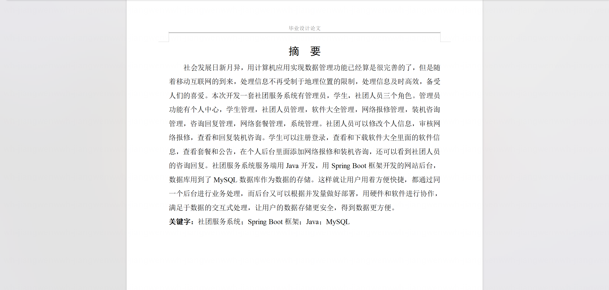

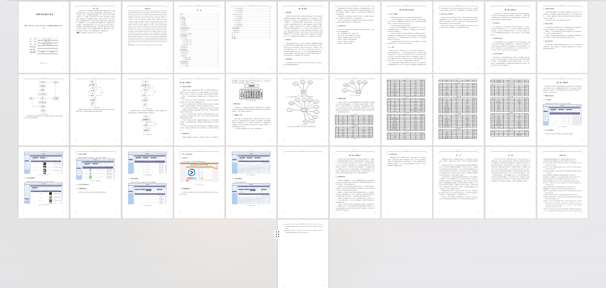

## 系统截图

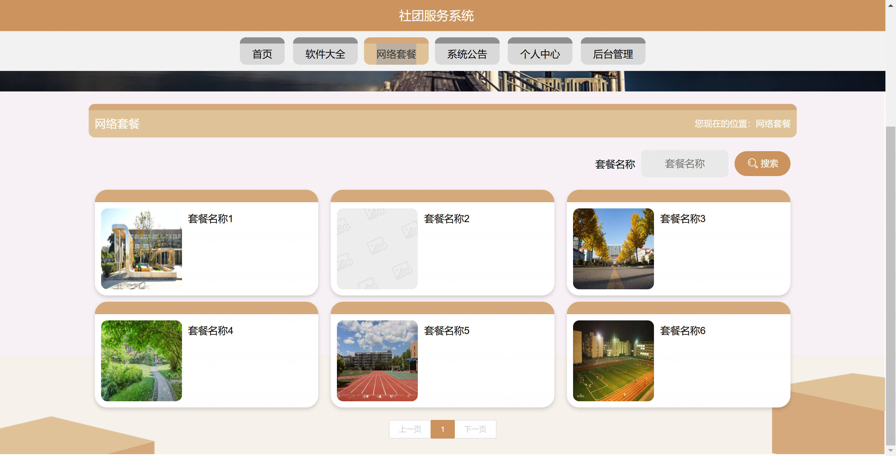

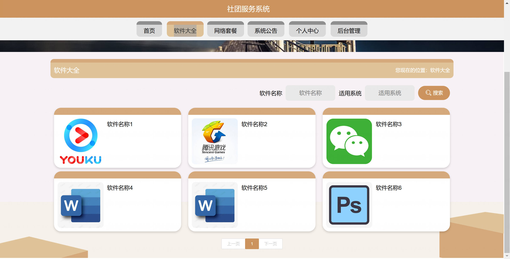

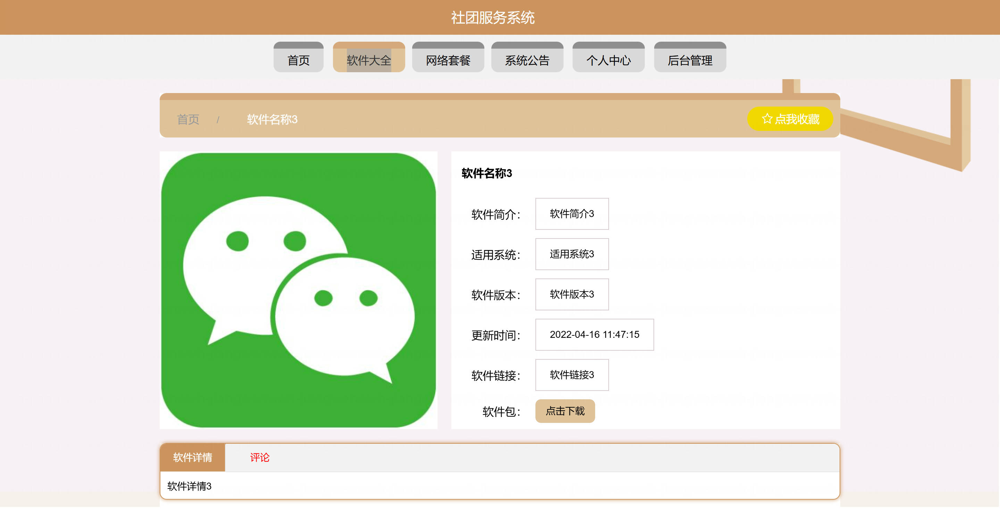

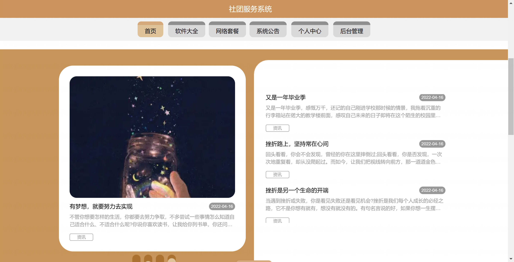

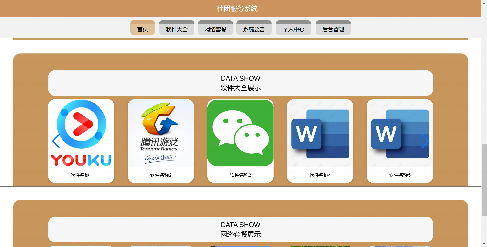

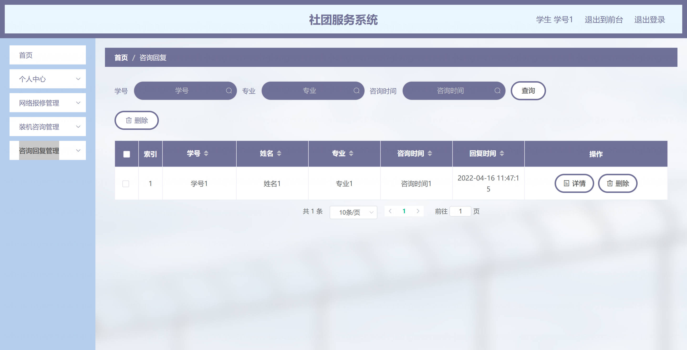

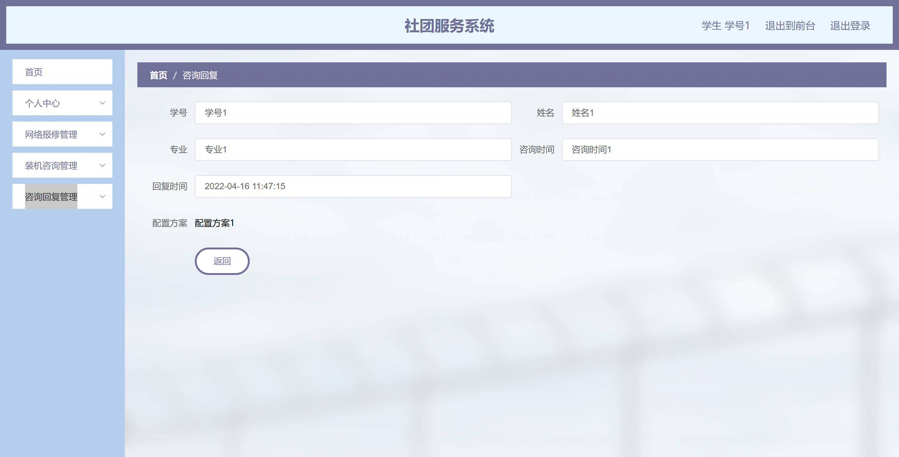

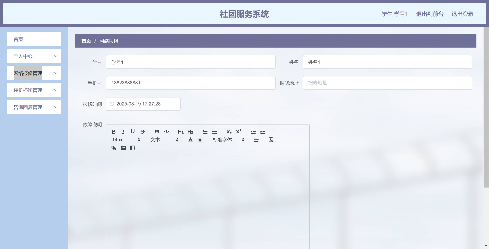

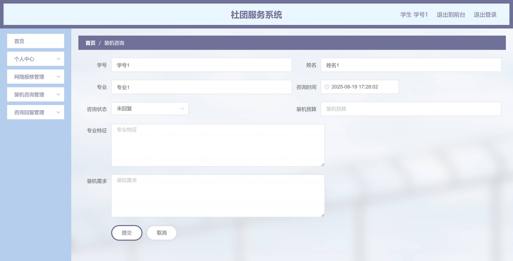